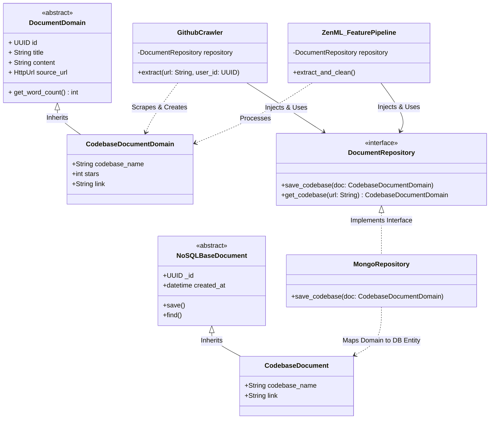
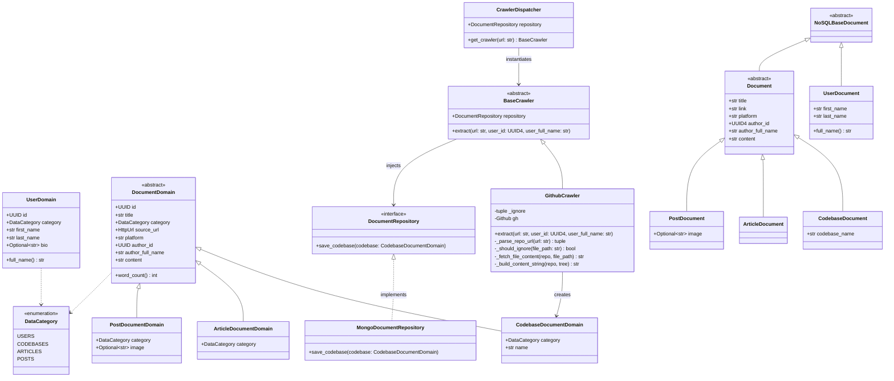

# Project structure

```text
flash_llm/
├── .github/                      # CI/CD workflows (GitHub Actions, Docker builds)
├── configs/                      # ZenML YAML configs & environment profiles
│   ├── etl.yaml
│   ├── feature_engineering.yaml
│   └── training.yaml
├── docker/                       # Container setups
│   ├── Dockerfile.zenml
│   └── Dockerfile.api
│
├── src/
│   └── flash_llm/                # Core Python Package
│       ├── __init__.py
│       ├── settings.py           # Centralized Pydantic BaseSettings (.env loader)
│       │
│       ├── domain/               # 🛑 Layer 0: Pure entities & schemas (Zero dependencies)
│       │   ├── __init__.py
│       │   ├── base.py           # Core entity abstractions
│       │   ├── documents.py      # Article, Post, Repository models
│       │   └── dataset.py        # Instruct & DPO dataset definitions
│       │
│       ├── application/          # ⚙️ Layer 1: Business Logic & Pipelines
│       │   ├── __init__.py
│       │   ├── crawlers/         # Polymorphic scrapers (GitHub, Medium, LinkedIn)
│       │   ├── cleaning/         # Text normalizers & chunking
│       │   ├── rag/              # Retrieval & prompt builder logic
│       │   └── evaluation/       # RAG/Model evaluation metrics logic
│       │
│       ├── infrastructure/       # 🔌 Layer 2: External Adapters & Services
│       │   ├── __init__.py
│       │   ├── db/               # MongoDB, Qdrant client wrappers
│       │   ├── clients/          # OpenAI, Anthropic, AWS S3 adapters
│       │   └── tracking/         # Comet ML & Opik loggers
│       │
│       ├── model/                # 🧠 Layer 3: ML Training & Fine-Tuning
│       │   ├── __init__.py
│       │   ├── finetune/         # SFT & DPO training scripts (Unsloth/TRL)
│       │   └── inference/        # vLLM / SageMaker serving handlers
│       │
│       ├── orchestration/        # 🔄 Layer 4: ZenML Pipeline DAGs & Steps
│       │   ├── __init__.py
│       │   ├── steps/            # Modular ZenML steps (@step)
│       │   └── pipelines/        # Composed ZenML DAGs (@pipeline)
│       │
│       └── interface/            # 🌐 Entrypoints (CLI & API)
│           ├── __init__.py
│           ├── cli.py            # Typer/Click CLI commands
│           └── api/              # FastAPI endpoints for inference/ingestion
│
├── tests/                        # Pytest suite
│   ├── unit/                     # Domain & application logic tests (Fast, no DB)
│   ├── integration/              # Infrastructure & DB tests
│   └── e2e/                      # End-to-end pipeline execution tests
│
├── .env.example                  # Environment variable template
├── .gitignore                    # Python/macOS/VS Code exclusions
├── .importlinter                 # Architectural constraints (Prevents domain pollution)
├── justfile                      # Command runner (Replaces poe/make)
├── pyproject.toml                # Managed via uv (Dependencies, ruff, pytest settings)
└── uv.lock                       # Deterministic dependency lockfile
```

### Add **init**.py to every directory inside src/

```
find src -type d -exec touch {}/__init__.py \;
```

# Architecture




